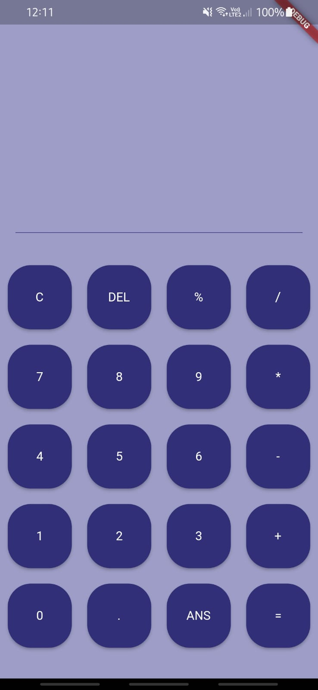
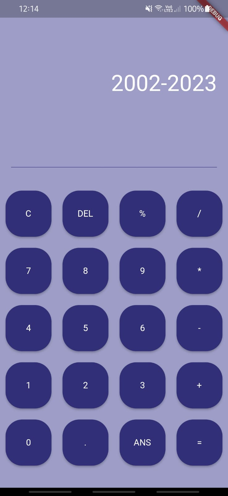
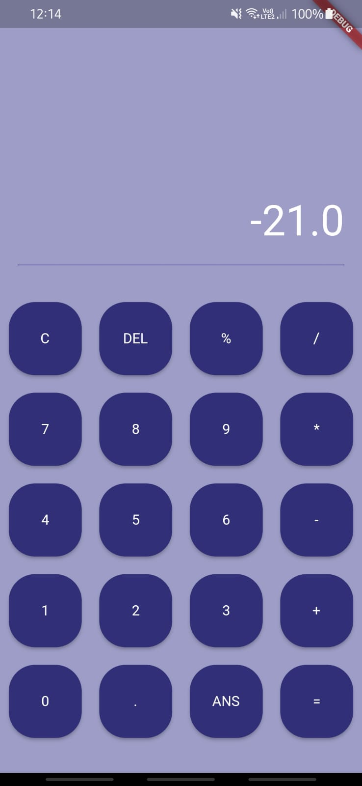

# Calculadora
última atualização 05/10/2023

Projeto criado para fornecer uma calculadora simples e funcional para cálculos básicos.

## Descrição

Este projeto é uma calculadora que permite realizar operações aritméticas básicas, como adição, subtração, multiplicação, divisão e porcentagem. A interface é amigável e fácil de usar, proporcionando uma maneira rápida de realizar cálculos diários.

## Capturas de Tela

<table>
  <tr>
    <td></td>
    <td></td>
    <td></td>
  </tr>
</table>
